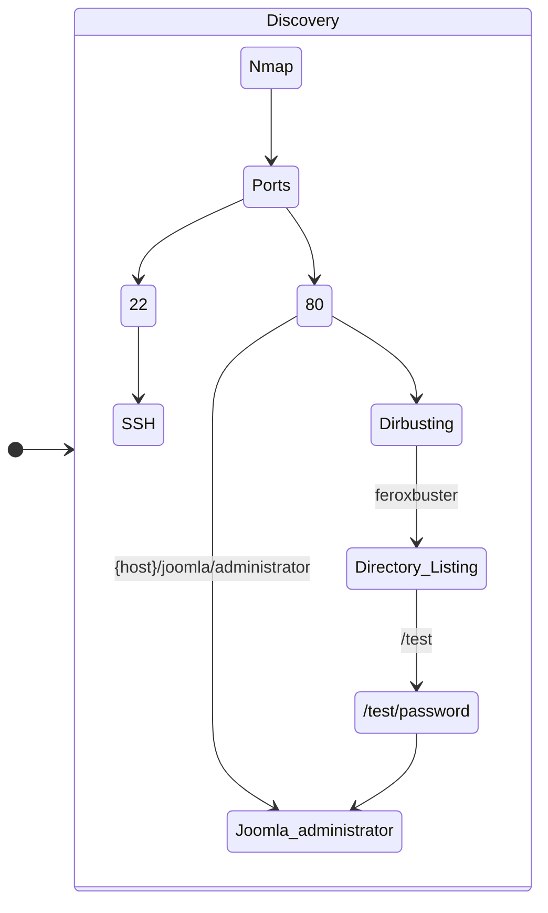
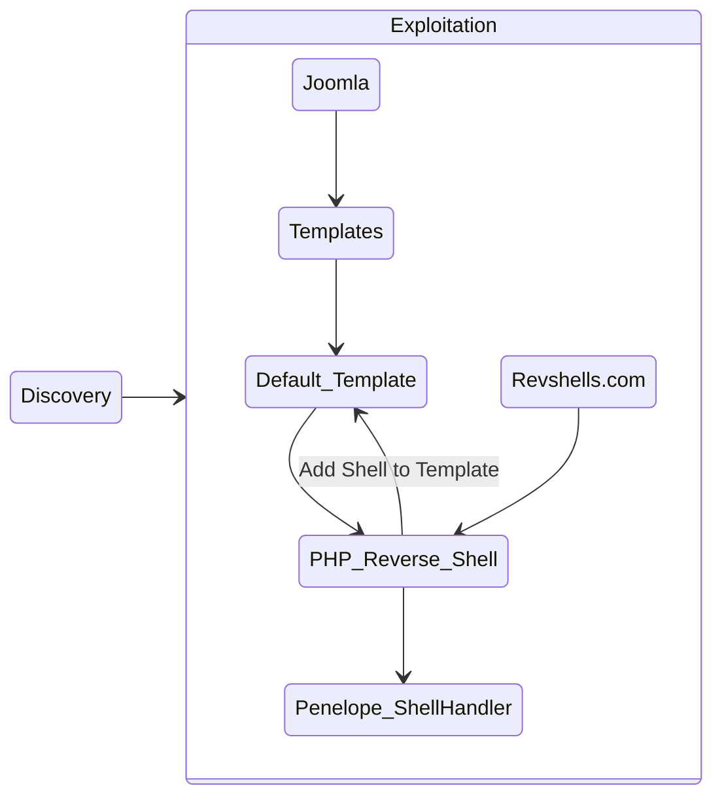
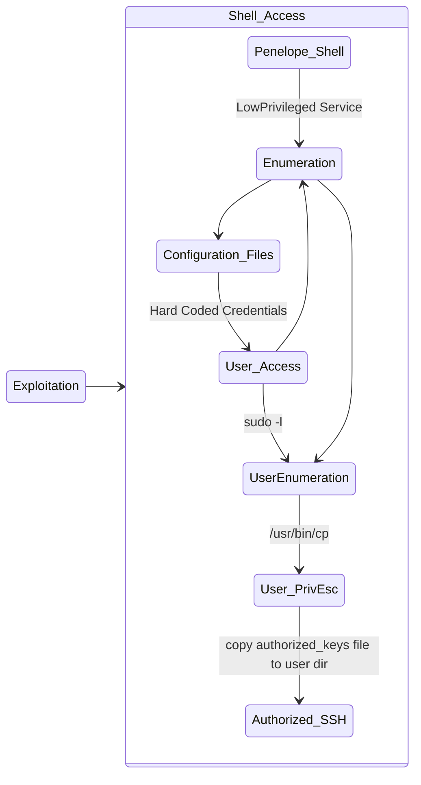
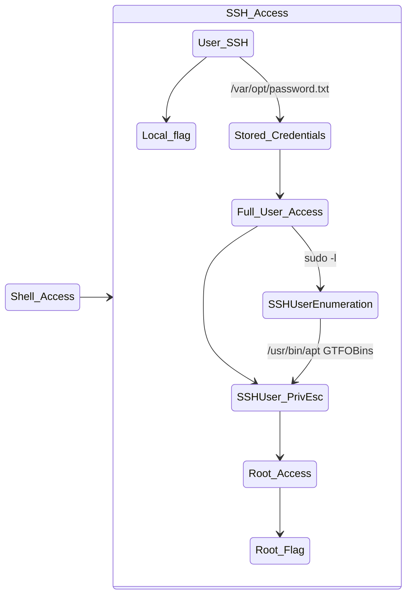

# KillChain

## Discovery

```mermaid
stateDiagram-v2
	state fork_state
		Direction LR
		[*] --> Discovery %% nmap {host} -p-
		state Discovery {
			Nmap --> Ports
				# note left of Nmap 
				# 	nmap {shenron_ip}  -p- 
				# end note 
				Ports --> 22
					22 --> SSH
				Ports --> 80
					80 --> Dirbusting
					80 --> Joomla_administrator: {host}/joomla/administrator
			Dirbusting -->	Directory_Listing: feroxbuster
				Directory_Listing --> /test/password: /test
				/test/password --> Joomla_administrator
					# note left of /test/password 
					#	view source to collect password 
					# end note
			}
```
## Exploitation

```mermaid
stateDiagram-v2
	state fork_state
		Direction LR
		Discovery --> Exploitation
		state Exploitation {
			Joomla --> Templates
				Templates --> Default_Template
				Default_Template --> PHP_Reverse_Shell
			Revshells.com --> PHP_Reverse_Shell
				PHP_Reverse_Shell --> Default_Template: Add Shell to Template
			PHP_Reverse_Shell --> Penelope_ShellHandler 
		}
```

## Shell Access

```mermaid
stateDiagram-v2
	state fork_state
		Direction LR
		Exploitation --> Shell_Access
		state Shell_Access {
			Penelope_Shell -->Enumeration: LowPrivileged Service 
				Enumeration --> Configuration_Files
					Configuration_Files --> User_Access :Hard Coded Credentials
				User_Access --> Enumeration
					User_Access --> UserEnumeration : sudo -l
					Enumeration --> UserEnumeration
					UserEnumeration --> User_PrivEsc : /usr/bin/cp
				User_PrivEsc --> Authorized_SSH : copy authorized_keys file to user dir
		}
```
## SSH Access

```mermaid
stateDiagram-v2
	state fork_state
		Direction LR
		Shell_Access --> SSH_Access
		state SSH_Access {
			User_SSH --> Local_flag
			User_SSH --> Stored_Credentials: /var/opt/password.txt
			Stored_Credentials --> Full_User_Access
			Full_User_Access --> SSHUser_PrivEsc
			Full_User_Access --> SSHUserEnumeration : sudo -l
			SSHUserEnumeration --> SSHUser_PrivEsc : /usr/bin/apt GTFOBins
			SSHUser_PrivEsc --> Root_Access
			Root_Access --> Root_Flag
		}

```

